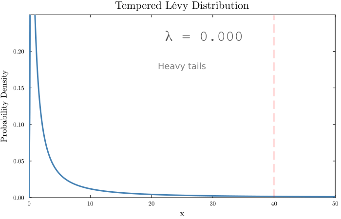
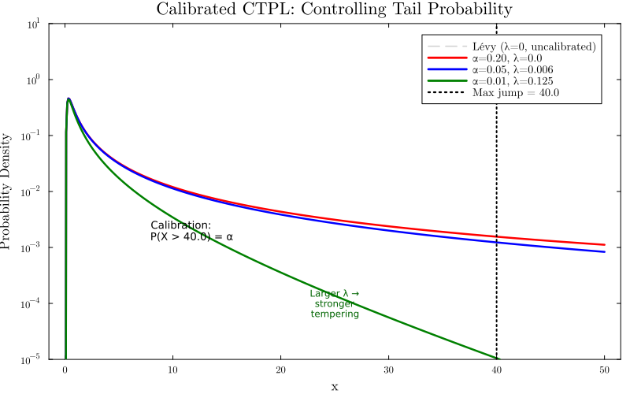

# CalibratedTemperedPowerLaw.jl

**Calibrated Tempered Power Law (CTPL) noise modeling**

[](https://github.com/systems-mechanobiology/CalibratedTemperedPowerLaw.jl/actions/workflows/ci.yml)
[](https://julialang.org/)
[](https://www.gnu.org/licenses/agpl-3.0)

Calibrated Tempered Power Law implements a tempered heavy-tailed noise model in which the tempering parameter is calibrated numerically to satisfy a prescribed tail-probability constraint prior to hard truncation. This enables finite-moment perturbations that respect domain-imposed displacement limits while retaining heavy-tailed behaviour.

## The CTPL Noise Model

The CTPL model provides **calibrated** control over noise by tempering the heavy tails of a Lévy distribution. The calibration problem solves for the optimal tempering parameter λ given a displacement limit L and tail probability α:

**Calibration Problem:**
```
Given: c (scale), L (displacement limit), α (tail probability)
Find: λ such that P(X > L) = α

where X ~ TemperedLévy(c, λ)
```

**Tempered Lévy PDF:**
```
f(x; c, λ, μ) = √(c / (2π(x-μ)³)) exp(-c/(2(x-μ)) - λ(x-μ))    for x > μ
```

The tempering factor exp(-λ(x-μ)) exponentially suppresses the heavy tail, with λ numerically calibrated via `autotune_lambda(c, L, α)`.



*Demonstration of tail suppression as the tempering parameter λ increases from 0 to 0.2. Larger λ values provide stronger control over tail behavior, shown with respect to the displacement limit (red dashed line at x=40).*



For the same maximum jump limit, different tail probability targets produce different noise regimes:
- **α = 0.20** (λ ≈ 0): Heavy power-law tails, frequent large jumps
- **α = 0.05** (λ ≈ 0.006): Moderate tail control (typical use case)
- **α = 0.01** (λ ≈ 0.125): Tight tail suppression, rare extreme events

This calibration enables precise noise specification: "I want 5% probability of jumps exceeding 40 units."

## Installation

```julia
using Pkg
Pkg.add(url="https://github.com/bencardoen/CalibratedTemperedPowerLaw.jl")
```

## Quick Start

```julia
using CalibratedTemperedPowerLaw
using Random

Random.seed!(42)

# Sample from a tempered Levy distribution
x = sample_tempered_levy(1.0, 0.1; limit=10.0)
println("Sampled value: $x")

# Auto-tune lambda to control tail probability
# Find lambda such that P(X > 40) ~ 0.05
lambda = autotune_lambda(1.0, 40.0, 0.05)
println("Tuned lambda: $lambda")

# Perturb a 2D coordinate with calibrated noise
v = [1.0, 2.0]
v_perturbed = levy_perturb(v, lambda, 1.0; limit=10.0)
println("Original:  $v")
println("Perturbed: $v_perturbed")
```

## Documentation

For full documentation including graph perturbation, spectral analysis, Stochastic Co-spectrality (SC), and the Stochastic Spectral Separation Index (S3I), see the [docs](docs/src/index.md).
